# Assignment 2 - Kinematic walking controller

**Hand-in:** Apr. 1, 2022, 18:00 CEST

----

Leave your name, student ID, ETH email address and URL link to demo video here.

- Name:
- Student ID:
- ETH Email:
- Demo Video URL:

----

In this assignment, we implement a kinematic walking controller for a legged robot!

Let's see the figure below.

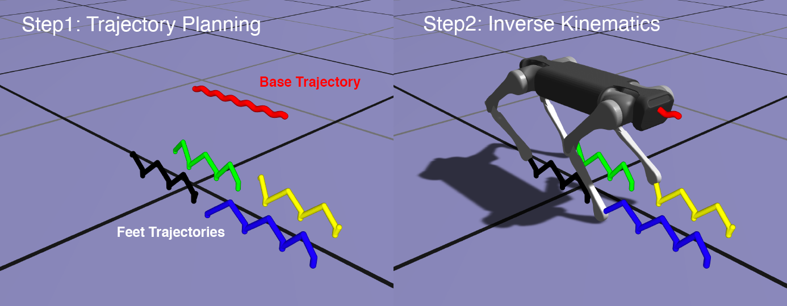

*Figure 1: The control pipeline of kinematic walking controller: 1) trajectory planning 2) computing desired joint
angles by IK.*

We start from five trajectories: 1 for base, and other 4 for feet. We plan the trajectories given target velocity of the
robot base (body) and a timeline of the foot contacts (i.e. *when* and *how long* does a foot contact with a ground.)
The details of how we plan the timeline of foot contacts, and how we generate the target trajectories, are out of scope
of this assignment. But in Ex.3, we will have a sneak peek of *trajectory planning* procedure for the robot's base.

Our goal is tracking all the five target trajectories at the same time. We will simplify this problem by assuming the
robot's base (somehow...) always perfectly tracks a target base trajectory. Then, we want to find **desired joint
angles** for each leg that allow the foot (i.e. the end effector of individual leg) to reach a target position. We can
effectively formulate this as an IK problem. Since the robot has four legs, by solving four IK problems, we can obtain
desired configuration of the robot.

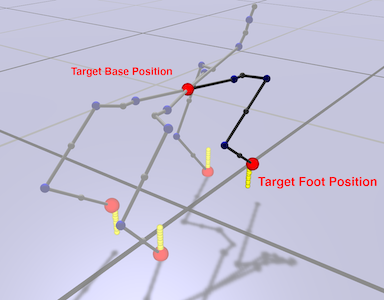

*Figure 2: Don't freak out!, this is a skeletal visualization of our Dogbot. Assuming the base is at the target
position, we want to find **desired joint angles** for each leg that allow the foot (i.e. the end effector of individual
leg) to reach its corresponding target position. Note. You can render skeletal view by Main Menu > Draw options > Draw
Skeleton.*

## Hand-in and Evaluation

Once you complete this assignment you should hand in

- code pushed to your github repository.
- a short video demonstrating Ex.5 implementation. (**Upload your video to YouTube and add a link to README.md**)

The grading scheme is as follows

- baseline (80 %): based on your code. Each exercise is counted as 20%.
    - Ex.1-3 will be evaluated by an auto grading system **after the deadline**. (the test sets are **not visible** to
      you)
- advanced (20 %): based on unit test, code and demo videos. Each exercise is counted as 10%.
    - Ex.4 will be evaluated by an auto grading system **after the deadline**. (the test sets are **not visible** to
      you)
    - Ex.5 will be evaluated based on your demo video.

**IMPORTANT:** If your code is not built successfully, you will get **zero** point from this assignment. So make sure
your code is built without any build/compile error. 

**IMPORTANT:** If the system detect a suspected plagiarism case, you will get **zero** point from this assignment.

Please leave your questions on GitHub, so your colleagues also can join our discussions.

## Exercises

Okay now let's do this step-by-step :)

### Ex.1 Forward Kinematics (baseline)

In order to formulate an IK problem, firstly, we have to express the positions of a foot as functions of joint angles (
and the base position). Formally speaking, given a *generalized coordinates* vector

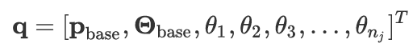

which is a concatenated vector of position of robot's base, orientation of robot's base and n<sub>j</sub> joint angles,
we need to find a map between **q** vector and end effector position **p**<sub>EE</sub> expressed in world coordinate
frame.

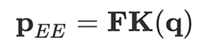

In the previous lecture, we learned how to find this map by **forward kinematics**.

**Code:**

- Files:
    - `src/libs/simAndControl/robot/GeneralizedCoordinatesRobotRepresenetation.cpp`
- Functions:
    - ```P3D getWorldCoordinates(const P3D &p, RB *rb)```

**Task:**

- Implement forward kinematics for point **p**.

**Details:**

- ```GeneralizedCoordinatesRobotRepresenetation``` represents the generalized coordinate vector **q**.
- ```P3D getWorldCoordinates(const P3D &p, RB *rb)``` returns position of a point in world coordinate frame. The
  arguments `p` is a position of the point in rigidbody `rb`'s coordinate frame.
- You may want to implement ```getCoordsInParentQIdxFrameAfterRotation(int qIndex, const P3D &pLocal)``` first: this
  function returns position of a point in the coordinate frame of the parent of `qIdx` after the DOF rotation has been
  applied.

Once you implement ```getWorldCoordinates``` function correctly, you will see green spheres around feet of the robot.

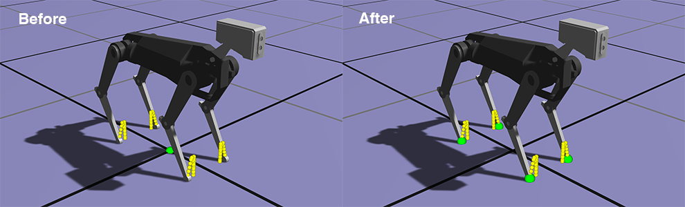

*Figure 3: Check if your implementation is correct. You should see the green spheres around the robot's feet.*

### Ex.2-1 Inverse Kinematics - Jacobian by Finite Difference (baseline)

Okay, now we can express the position of the feet as a function of joint angles. It's time to formulate an IK problem:
we want to find a generalized coordinate vector **q**<sup>desired</sup> given end effector target position **p**<sub>
EE</sub><sup>target</sup>.

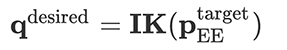

In the last assignment, we learn how to formulate the inverse kinematics problem as an optimization problem.

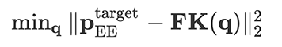

We can solve this problem using [gradient-descent method](https://en.wikipedia.org/wiki/Gradient_descent)
, [Newton's method](https://en.wikipedia.org/wiki/Newton%27s_method_in_optimization),
or [Gauss-Newton method](https://en.wikipedia.org/wiki/Gauss%E2%80%93Newton_algorithm). Whatever optimization method you
choose, we need a [Jacobian matrix](https://en.wikipedia.org/wiki/Jacobian_matrix_and_determinant) of the feet point.
Remember, Jacobian is a matrix of a vector-valued functions's first-order partial derivatives.

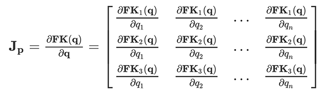

For now, we will use finite-difference (FD) for computing Jacobian. The idea of finite difference is simple. You give a
small perturbation *h* around jth component of **q**, and compute the (i,j) component as follows.


**Code:**

- Files:
    - `src/libs/simAndControl/robot/GeneralizedCoordinatesRobotRepresenetation.cpp`
- Functions:
    - ```void estimate_linear_jacobian(const P3D &p, RB *rb, Matrix &dpdq)```

**Task**:

- Complete ```estimate_linear_jacobian``` functions that computes a Jacobian matrix of position/vector by FD.

**Details:**

- We use [central difference](https://en.wikipedia.org/wiki/Finite_difference#Basic_types) with a perturbation *h*
  0.0001.

### Ex.2-2 Inverse Kinematics - IK Solver (baseline)

Now, it's time to implement a IK solver. Use **Gauss-Newton** methods we learned in the previous lecture.

We solve four independent IK problems (one for each leg.) Let's say **q**<sup>desired,i</sup> is a solution for ith
feet.

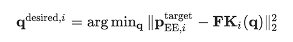

We can just solve each IK problem one by one and sum up the solutions to get a full desired generalized coordinates **
q**<sup>desired</sup>.

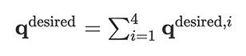

**Code:**

- Files:
    - `src/libs/kinematics/IK_solver.h`
- Functions:
    - ```void solve(int nSteps = 10)```

**Task**:

- Implement an IK solver based on the Gauss-Newton method.

**Details:**

- Use Jacobian matrix computed by `gcrr.estimate_linear_jacobian(p, rb, dpdq)` we implemented for Ex. 2-1.
- I left some useful hints on the source code. Please read it carefully.
- When you overwrite eigen matrix variable values in a single statement, you should use ```eval()``` function to prevent
  corruption. (note. this is caused by *aliasing*. See [this](https://eigen.tuxfamily.org/dox/group__TopicAliasing.html)
  for more details.) For example,

```cpp
// overwrite Matrix J in a single statement
// use eval() function!
J = J.block(0,6,3,q.size() - 6).eval();
```

Let's see how the robot moves. Run ```locomotion``` app and press **Play** button (or just tap **SPACE** key of your
keyboard). Do you see the robot trotting in place? Then you are on the right track!

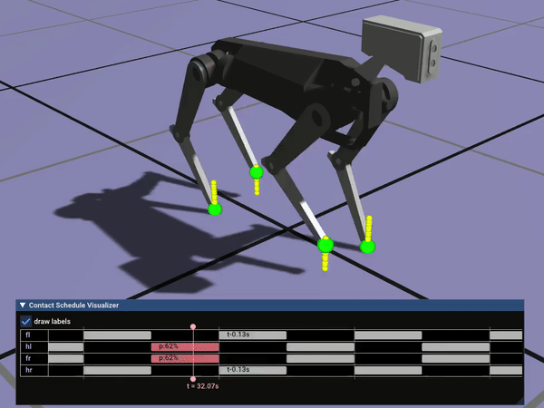

### Ex.3 Trajectory Planning (baseline)

Now, let's give some velocity command. Press **ARROW** keys of your keyboard. You can increase/decrease target forward
speed with up/down key, and increase/decrease target turning speed with left/right key. You can also change the target
speed in the main menu.

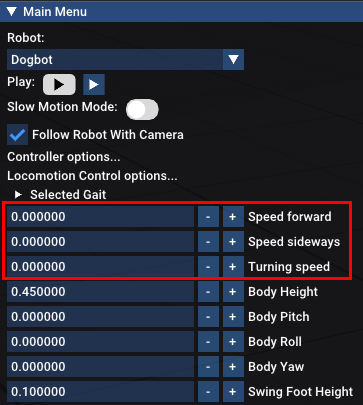

Oops! The base of the robot is not moving at all! Well, a robot trotting in place is already adorable enough, but this
is not what we really want. We want to make the robot follow our input command.

Let's see what happens here. Although I'm giving 0.3 m/s forward speed command, the target trajectories (red for base,
white for feet) are not updated accordingly. With a correct implementation, the trajectory should look like this:

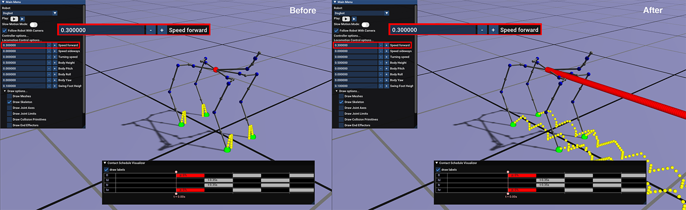

**Code:**

- Files:
    - `src/libs/simAndControl/locomotion/LocomotionPlannerHelpers.h`
- Class:
    - `bFrameReferenceMotionPlan`
- Function:
    - ```void generate(const bFrameState& startingbFrameState)```

**Task**:

- Your task is completing ```generate``` function so that it updates future position and orientation according to our
  forward, sideways, turning speed commands.

**Details:**

- We plan the target base trajectory by numerical integration: we integrate forward, sideways and turning speed to get
  future position and orientation.

Once you finish this step, you can now control the robot with your keyboard.

By the way, planning the feet trajectories is a bit more tricky. I already implemented a feet trajectory planning
strategy in our code base so that once you complete ```generate``` function, the feet trajectory is also updated by user
commands. I will not explain more details today, but if you are interested, please read the paper, *Marc H. Raibert et
al., Experiments in Balance with a 3D One-Legged Hopping Machine, 1984*. Although this is a very simple and
long-standing strategy, almost every state-of-the-art legged robot still uses this simple heuristic. (Sidenote. Marc
Raibert, who was the group leader of [Leg Laboratory, MIT](http://www.ai.mit.edu/projects/leglab/home.html), later
founded [Boston Dynamics Company](https://www.bostondynamics.com/) in 1992.)

-----
From now on, we will improve our kinematic walking controller.

### Ex.4 Analytic Jacobian (advanced)

Okay, we compute Jacobian matrix with FD. But in general, FD is not only inaccurate but also very slow in terms of
computation speed. Can we compute Jacobian matrix analytically? The answer is yes. With a small extra effort, we can
derive analytic Jacobian matrix, and implement this into our code.

**Code:**

- Files:
    - `src/libs/simAndControl/robot/GeneralizedCoordinatesRobotRepresenetation.cpp`
- Functions:
    - ```void compute_dpdq(const P3D &p, RB *rb, Matrix &dpdq)```

**Test:** Compile and run `src/test-a2/test.cpp`. Test 4 should pass. Note that **passing this test does not necessarily
mean you get a full point** Your implementation should give correct results for every case. We will auto-grade your
implementation with bunch of test cases after the deadline.

### Ex.5 Uneven Terrain (advanced)

Our robot can go anywhere in the *flat-earth world*. But, you know, our world is not flat at all. Now, we will make our
robot walk on an bumpy terrain. Imagine you have a height map which gives you a height of the ground of given (x, z)
coordinates (note that we use y-up axis convention i.e. y is a height of the ground.) To make the robot walk on this
terrain, the easiest way is adding offset to y coordinates of each target positions.


You have a full freedom to choose the terrain map you want to use: you can just create a bumpy terrain by adding some
spheres in the scene as I've done here. Or you can download a landscape mesh file in **.obj** format (there's an example
terrain obj file in data folder). Please figure out the best strategy to implement this by your own.

**IMPORTANT:** For Ex.5, create a new git branch named ```ex5``` and push your code there while your implementation of
Ex.1-4 still remains in main branch. If your Ex.5 implementation breaks Ex.1-4, you may not get full points from Ex.1-4.

**Task**:

- Make the robot walk on an uneven terrain (5%)
- Visualize your terrain in ```locomotion``` app (5%).
- **Please record a video ~ 20 secs demonstrating your implementation. The robot in the video should walk on an uneven
  terrain, and your video should be visible enough to see how well your controller performs the task. Upload it to
  YouTube or any other video hosting website and add its link to on the top of this README.md.** If I cannot play or
  access your video until the deadline, you won't get full points.
- Please adjust your camera zoom and perspective so that your robot is well visible in the video. You may not get full
  point if your robot is not clearly visible.

**Hint:**

- We want to give y-offset to IK targets. But remember, offset value for each target could be different.
- Do not change ```double groundHeight = 0;``` in ```SimpleLocomotionTrajectoryPlanner```. This will merely give the
  same offset to every target trajectory. We want to give different offset for each individual foot and the base.

## Final Note

Congratulations! You can now control the legged robot! Hooray!

Can we use our kinematic walking controller to a real robot? Well... unfortunately it's not very easy. In fact, working
with a real robot is a completely different story because we need to take into account **Dynamics** of the robot. But,
you know what? We have implemented fundamental building blocks of legged locomotion control. We can extend this idea to
control a real robot someday!

By the way, can you make a guess why using kinematic controller for a real legged robot doesn't really work well in
practice? If you are interested in, please leave your ideas on the GitHub issue.